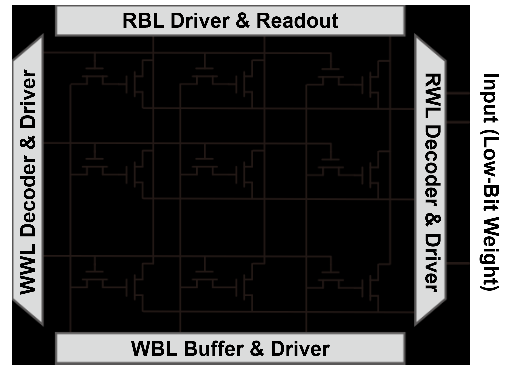

# 阵列结构

eDRAM的基本存储是一个2T0C的结构，由两个NMOS组成。
其中一个NMOS用自己的栅电容来存储电荷（图中为竖直放置的管子），称为存储管，其源端接RWL，漏端接RBL。
另一个NMOS管用于控制向存储管写入电荷，称之为写入管，其源端接存储管的栅极，漏端接WBL，栅端接WWL。

本项目测试的eDRAM阵列为64*64的规模，即RWL, RBL, WWL, WBL各自有64条，形成mesh结构。

# 控制时序
## 写入
1. 在无写入任务时，WWL为低电平，写入管不导通
2. 若选中WWL_x进行写入操作，则WWL_x为高电平，其余WWL为低电平。WWL_x会选中一列cell进行写入操作，需要在
